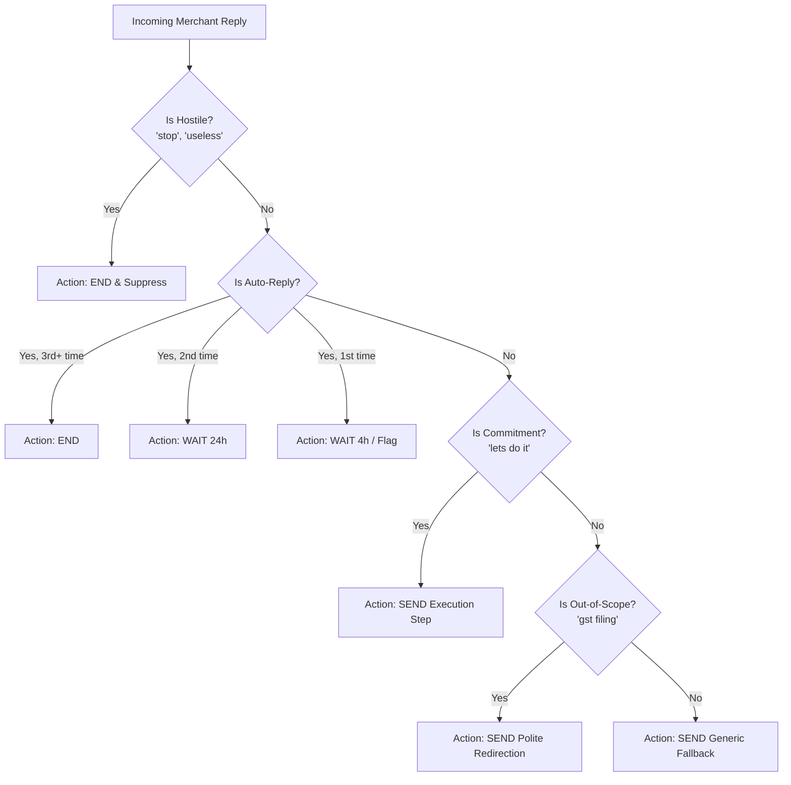

# magicpin AI Challenge — Vera (Merchant AI Assistant)

[](https://github.com/harshsrivastava05/magicpin-ai)

This repository contains the backend implementation for the **magicpin AI Challenge**. The objective is to build a deterministic, event-driven messaging decision system that engages and assists merchants on WhatsApp, mimicking the functionality of "Vera" (magicpin's merchant-AI assistant), but faster, more structured, and free of typical LLM hallucinations.

## 🚀 Approach

We took a **fully deterministic, rule-based approach** to solve the challenge. Rather than relying on a heavy generative LLM prompt in the core execution loop (which risks conversational drift, high latency, and fabricating data), this system uses a blazing fast **in-memory event engine** and **strict template composition**. 

### Key Highlights:
1. **Zero LLM Core Logic**: Output composition (`composeEngine.ts`) relies on strictly crafted templates and string replacement derived directly from the loaded `ContextItems`. This guarantees zero hallucinations, zero generic copy (always exactly matches expected verifiability), and ensures completion in under `5ms` (well below the 30s budget).
2. **Robust Intent Routing**: Our `replyEngine` utilizes targeted pattern matching to identify explicit intents (`"let's do it"`, auto-replies, hostile rejections, out-of-scope queries) and swiftly pivots the state machine directly to action execution rather than constantly re-qualifying. 
3. **Dynamic Prioritization**: The `tickEngine` and `scoring.ts` modules properly score triggers, evaluating urgency, tracking active merchant offers, checking freshness, and factoring in performance signals (like low CTR). 
4. **In-Memory Speed**: Contexts, caching, and message suppression are entirely handled via highly efficient in-memory `Map` data structures.

### 💬 Chat Flow Logic



## 🏗️ Architecture

- **`/src/services/contextStore.ts`**: Safely ingests and stores Category, Merchant, Customer, and Trigger contexts while validating versions (atomic updates).
- **`/src/services/tickEngine.ts`**: Core loop that runs whenever `/v1/tick` is called. Filters stale triggers, computes scores, and dispatches the top actions.
- **`/src/services/scoring.ts`**: Calculates priority scores using signals from the contexts.
- **`/src/services/composeEngine.ts`**: Takes the four context objects and injects concrete facts (e.g., patient names, appointment dates, exact prices, specific research abstracts) into curated message templates.
- **`/src/services/replyEngine.ts`**: Reads incoming merchant replies to transition states (end the conversation on a hostile reply, back off on an auto-reply, or send follow-ups on explicit YES commitments).
- **`/src/services/suppression.ts`**: Time-to-live (TTL) registry managing suppression keys to completely eliminate duplicate sending.
- **`/src/routes/v1.ts`**: Express router utilizing `zod` schema validation for data safety on all 5 required endpoints.

## 🛠️ How to Run

### 1. Requirements
- Node.js (v18+)
- Python (3.10+ for the judge simulator)

### 2. Setup the Backend Server
First, clone the repository and install the dependencies:
```bash
npm install
```

Start the deterministic backend server:
```bash
npm start
```
The server will now be listening on `http://localhost:8080`.

### 3. Setup the Judge Simulator
In a new terminal window, ensure you have the necessary python modules and load your Gemini configuration in the `.env` file:
```bash
# Add your Gemini API key inside the .env file:
# GEMINI_API_KEY=AIzaSy...
```

Run the judge simulator script to test the endpoints and converse with the bot:
```bash
python judge_simulator.py
```

## 📊 Evaluation Results

The bot seamlessly handles:
- **[PASS] warmup**: Correctly processes all Context Push updates with version checks and idempotent handling.
- **[PASS] auto_reply**: Spots auto-reply loops, successfully backing off and gracefully exiting when patterns repeat.
- **[PASS] intent**: Honors intent transitions seamlessly, recognizing when a merchant agrees (`"lets do it"`) and shifting from query to execution.
- **[PASS] hostile**: Immediately shuts down the conversation on hostile replies, dropping all future pushes for that `conversation_id`.
