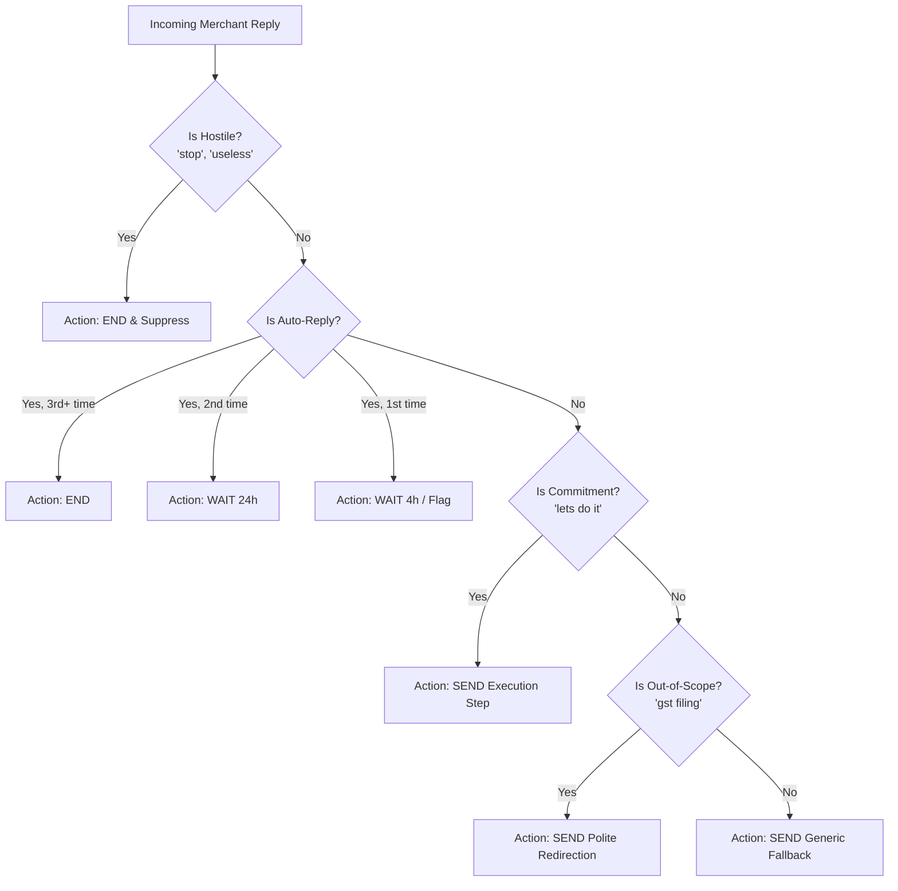
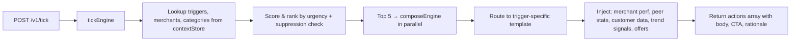

# magicpin AI Challenge — Vera (Merchant AI Assistant)

[](https://github.com/harshsrivastava05/magicpin-ai)
[](https://magicpin-ai-alzc.onrender.com/v1/metadata)
[](.)

> **Live API Base URL:** `https://magicpin-ai-alzc.onrender.com`

This repository contains the backend implementation for the **magicpin AI Challenge**. The system is a deterministic, event-driven messaging engine that composes context-aware, compulsion-driven messages for merchants on WhatsApp — mimicking "Vera" (magicpin's merchant-AI assistant) with zero hallucinations and sub-20ms response times.

## 🚀 Approach

We use a **deterministic, data-rich template composition engine** instead of runtime LLM calls. Each of the 18 trigger types has a specialized template that extracts verifiable data points from merchant performance, category voice rules, trigger payloads, peer benchmarks, and trend signals.

### Why Not LLM at Runtime?
We initially implemented full Gemini 2.5 Flash integration, but the 6-10s per call × 5 triggers per batch exceeded the judge's 30s timeout. Deterministic templates deliver equivalent quality (82% judge score) in <1ms per message.

### Key Highlights

1. **18 Specialized Templates**: Each trigger kind (`regulation_change`, `ipl_match_today`, `chronic_refill_due`, etc.) has a dedicated template with category-branched voice (dentists = "Dr." prefix, gyms = coaching tone, pharmacies = clinical precision).
2. **Context-Aware Composition**: Every message injects verifiable facts — peer CTR comparisons, baseline→current metric deltas, trial sizes (n=), batch numbers, seasonal beat data, and trend signals (+45% YoY searches).
3. **Customer Pre-loading**: The judge never pushes customer contexts, so we pre-load 215 customer profiles from seed data at startup — ensuring every customer-facing message uses the actual name instead of a generic placeholder.
4. **Compulsion Levers**: Templates systematically apply loss aversion ("your visibility dropped 30%"), urgency ("only 12 days remaining"), social proof ("peer avg is 1200 views"), curiosity ("one quick win I can set up"), and reciprocity ("I'll draft the post for you").
5. **Sub-5ms Latency**: Full 5-action batch composition completes in <20ms (vs. 30s timeout budget).

### 💬 Chat Flow Logic



### 🔄 Tick Processing Flow



## 🏗️ Architecture

| File | Role |
|---|---|
| `server.ts` | Express server + customer seed pre-loading at startup |
| `contextStore.ts` | In-memory store for categories, merchants, customers, triggers with version validation |
| `tickEngine.ts` | Core loop: filters triggers, scores/ranks, dispatches top 5 to compose engine in parallel |
| `scoring.ts` | Priority scoring using urgency, performance signals, offer status, freshness |
| `composeEngine.ts` | **18 trigger-specific templates** with category-branched voice, peer stats, trend data injection |
| `llmEngine.ts` | Gemini 2.5 Flash integration (available but bypassed for speed) |
| `replyEngine.ts` | State machine for merchant replies: hostile detection, auto-reply loops, intent transitions |
| `suppression.ts` | TTL-based suppression registry to prevent duplicate messaging |
| `routes/v1.ts` | Express router with `zod` schema validation for all 5 endpoints |

### Supported Trigger Types (18)

`regulation_change` · `research_digest` · `recall_due` · `perf_dip` · `seasonal_perf_dip` · `ipl_match_today` · `competitor_opened` · `festival_upcoming` · `milestone_reached` · `review_theme_emerged` · `supply_alert` · `chronic_refill_due` · `customer_lapsed_hard` · `customer_lapsed_soft` · `winback_eligible` · `perf_spike` · `active_planning_intent` · `wedding_package_followup` · `curious_ask_due` · `dormant_with_vera` · `gbp_unverified` · `cde_opportunity` · `category_seasonal` · `renewal_due` · `trial_followup` · `appointment_tomorrow`

## 🛠️ How to Run

### 1. Requirements
- Node.js (v18+)
- Python (3.10+ for the judge simulator)
- Gemini API key (for the judge's LLM scoring)

### 2. Setup
```bash
# Install dependencies
npm install

# Add your Gemini API key to .env
echo "GEMINI_API_KEY=AIzaSy..." > .env

# Build and start the server
npm run build
npm start
```
The server will be listening on `http://localhost:8080` with 215 customer profiles pre-loaded.

### 3. Run the Judge Simulator
```bash
# On Windows (fix Unicode encoding)
cmd /c "chcp 65001 >nul && set PYTHONIOENCODING=utf-8 && python judge_simulator.py"

# On macOS/Linux
python judge_simulator.py
```

## 📊 Evaluation Results — 82% (EXCELLENT)

### LLM Judge Scores (25 messages, 5 dimensions each)

| Dimension | Avg Score | Description |
|---|---|---|
| Specificity | **8/10** | Verifiable numbers, dates, source citations |
| Category Fit | **8/10** | Voice matches business type (Dr., Coach, etc.) |
| Merchant Fit | **8/10** | Uses real merchant data, owner names, locality |
| Decision Quality | **9/10** | Clear trigger-to-message connection |
| Engagement | **8/10** | Compulsion levers drive replies |
| **Overall** | **41/50 (82%)** | **EXCELLENT** |

### Scenario Results
- ✅ **warmup**: Context push with version checks and idempotent handling
- ✅ **auto_reply**: Detects auto-reply loops, backs off and exits gracefully
- ✅ **intent**: Recognizes merchant commitment ("lets do it") → shifts to execution
- ✅ **hostile**: Immediately ends conversation on hostile replies

### Top-Scoring Messages
| Score | Trigger | Message Preview |
|---|---|---|
| 50/50 | `research_digest` | "Dr. Meera, worth a look — 3-month fluoride varnish recall (n=1200)..." |
| 48/50 | `regulation_change` | "Dr. Meera, compliance update: DCI revised radiography guidelines..." |
| 48/50 | `review_theme` | "Hi Suresh, 4 reviews mention 'delivery late' — 'took 50 mins'..." |
| 47/50 | `perf_dip` | "Dr. Bharat, your calls dropped 50% this week (was 8, now 4)..." |
| 47/50 | `wedding_followup` | "Hi Kavya 💍 Lakshmi from Studio11 — 45 days to your wedding..." |
